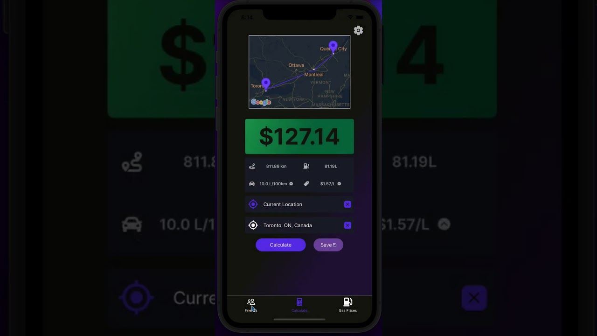

# GasMeUp ⛽

## React Native App

### Description 📚

An app to make splitting rides easier for everyone. A service to easily calculate your due gas-money and split easily to your riders. Just put in your riders, your route, and we will do the rest.

### Infrastructure 🏗️

The front end of this app was written in React Native and built using the Expo project manager. The backend is a Node.js server that hosts an Express API that the client can fetch data from. On this server we calculate the distances of routes and provide autocomplete location suggestions by utilizing the Google Maps API. The server also fetches current gas prices from my [Gas Price API](https://rapidapi.com/mmcardle-drx9FYQNK/api/canadian-gas-prices/). Also on the backend is a variety of Firebase services used to store data and manage user authentication. This is done through Firestore and Firebase Functions.

### Related Concepts / Learnings 💭

* React Native
* Expo
* Node.js
* Mobile Development
* Consuming APIs
* Firebase

<hr>
<br>

## Client

The client for this application is built using React Native. The source code is stored under the `/app` directory. To start the Expo server run:

```
npm run client
```

## Server

The server for this application hosts an API using Express and Node.js. It fetches from an [API](https://rapidapi.com/mmcardle-drx9FYQNK/api/canadian-gas-prices/) I built for current gas prices and the Google Maps API for locations and route distances. To start the Node server, go to the `/server` directory and run:

```
npm run start
```

The server is hosted through Google Cloud's App Engine. To deploy a new version to production run the following command in the `/server` directory:

```
npm run deploy
```

## Functions

This project utilizes Firebase Functions for server-side actions in response to changes made in the Firestore database. These actions involve sending friend requests, updating balances after new transactions, and sending push notifications. The code for this is all stored under the `/functions` directory.

To start a shell to test functions locally run:

```
npm run shell
```

To deploy the functions to Firebase run:

```
npm run deploy
# OR
npm run deploy:prod
```

## Firebase Admin SDK

Inside the `/firebase-admin` directory there is code to perform useful actions on the Firebase services for this project. This involves actions such as running migrations to restructure all documents in a collection programmatically.


## Demo Video
[](https://youtu.be/QExssPr8QSU)
